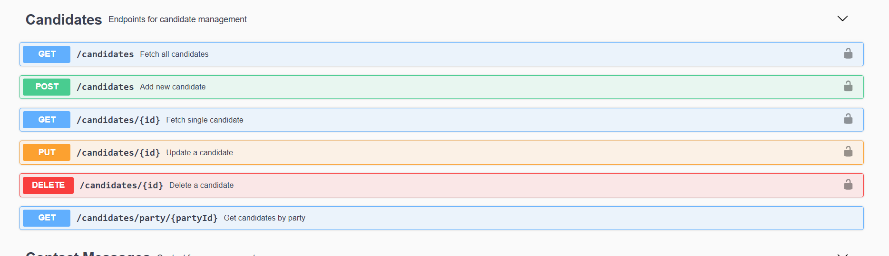
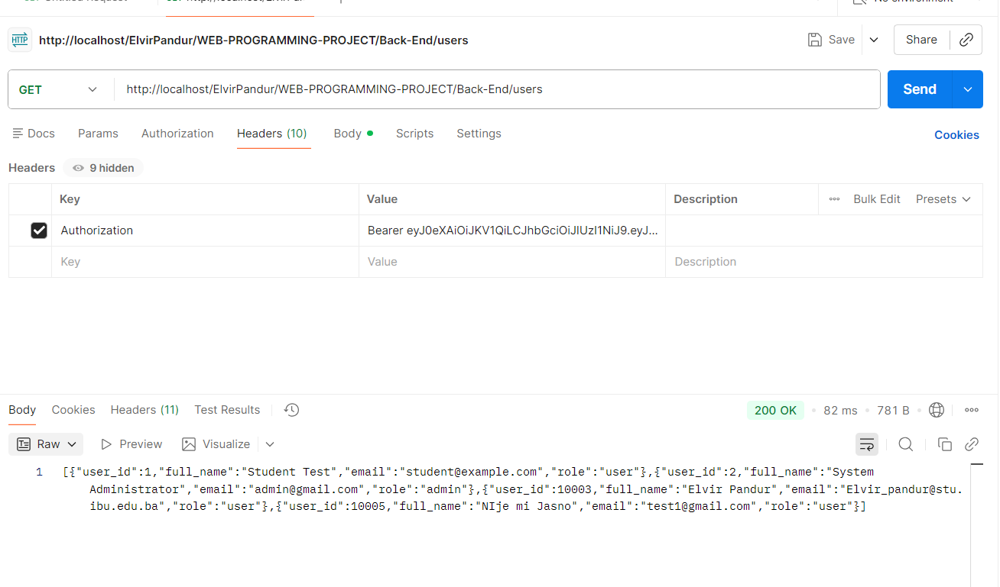
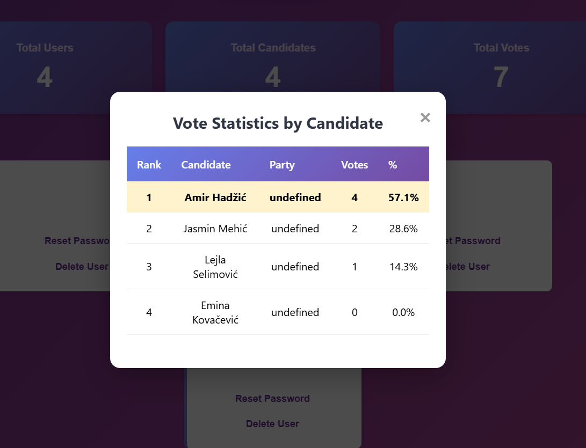

# Web-Programming-Project

Milestone 1 - Done
Milestone 2 - Done
Milestone 3 - Done
Milestone 4 - Done

moram izbrisati dashdao route i dao folder i servis

putem base dao moram implementirati funkciju koja count broji id od usera 

zatim u admin dao koji koristi to i prikazuje koliko je ljudi glasalo

zatim amni routes tjs pozvati da vidimo koliko je usera glasalo

Voting System

## Overview
The Voting System project is a web-based application designed to allow users to securely vote for candidates in various elections. The system ensures that votes are counted accurately and that each user can only vote once per election.

## Features
- **User Registration & Authentication:** Users can register and log in securely.
- **Election Management:** Admins can create, edit, and delete elections.
- **Candidate Management:** Admins can add, edit, or remove candidates for each election.
- **Voting:** Authenticated users can cast their vote for their preferred candidate.
- **Results Display:** Real-time results for each election are available.
- **Security:** Ensures data integrity and prevents multiple votes from a single user.

## Technology Stack
- **Frontend:** HTML, CSS, JavaScript (or React/Vue if applicable)
- **Backend:** Node.js/Express or PHP (adjust according to your project)
- **Database:** MySQL / PostgreSQL / MongoDB
- **Authentication:** JWT / Session-based authentication

Sql DataBase is updated v2
